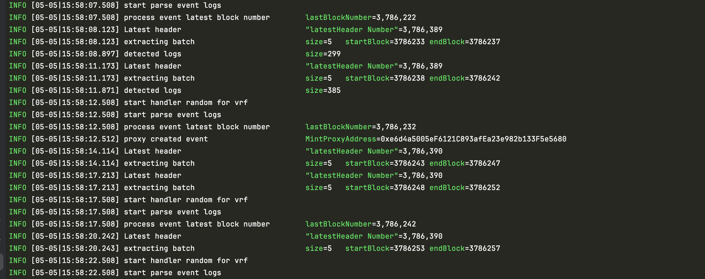

# VRF Service

## 实操
```bash
VRFService on  main [!?] via 🐹 v1.24.2 
➜ make
env GO111MODULE=on go build -ldflags "-X main.GitCommit=922c27caf3245e1a14baebc5d7180fdc8e570e6d -X main.GitDate=1739688474 -X main.GitVersion=" ./cmd/vrf_service

VRFService on  main [!?] via 🐹 v1.24.2 
➜ ls                   
CHANGELOG.md       README.md          bindings           common             driver             flags              golangci-lint.yaml synchronizer       vrf_service.go
LICENSE            _typos.toml        cliff.toml         config             ethereumcli        go.mod             hsm                tx_manager         worker
Makefile           abis               cmd                database           event              go.sum             migrations         vrf_service

VRFService on  main [!?] via 🐹 v1.24.2 
➜ ./vrf_service        
NAME:
   vrf_service - A new cli application

USAGE:
   vrf_service [global options] command [command options] [arguments...]

VERSION:
   1.15.1-stable-922c27ca

DESCRIPTION:
   An indexer of all optimism events with a serving api layer

COMMANDS:
   index    
   migrate  
   version  
   help, h  Shows a list of commands or help for one command

GLOBAL OPTIONS:
   --help, -h     show help
   --version, -v  print the version

VRFService on  main [!?] via 🐹 v1.24.2 
➜ source .env

VRFService on  main [!?] via 🐹 v1.24.2 
➜ ./vrf_service migrate
INFO [05-05|15:12:17.408] Running migrations...
INFO [05-05|15:12:17.409] loaded chain config                      config="{ChainRpcUrl:https://eth-holesky.g.alchemy.com/v2/YLgbp9I-spejSR_9EHp_-UYDrIYdrwE1 ChainId:17000 StartingHeight:3786162 Confirmations:3 BlockStep:5 Contracts:[0x9BA23eDAdC4A8c4Ee896B736bCCBafe2A18da2D2] MainLoopInterval:5s EventInterval:5s CallInterval:5s PrivateKey:4bf7f6821ade025a0cf81e376f5ed382a1433f3a81d598a7d6bfeb04c655b7d2 VerifyRandVRFContractAddress:0x139afDecf7Fc799d59BD3b915252944f73E155D5 VerifyRandVRFFactoryContractAddress:0x00189Cae228389b61f68B4e3520393941dAAD6e1 CallerAddress:0x750Ea21c1e98CcED0d4557196B6f4a5974CCB6f5 NumConfirmations:3 SafeAbortNonceTooLowCount:3 Mnemonic:test test test test test test test test test test test junk CallerHDPath: Passphrase:}"

VRFService on  main [!?] via 🐹 v1.24.2 
➜ ./vrf_service index  
INFO [05-05|15:13:56.446] run  vrf

```


## 数据库查看
```sql
VRFService on  main [!?] via 🐹 v1.24.2 
➜ psql
psql (17.4 (Homebrew))
输入 "help" 来获取帮助信息.

qiaopengjun=# \l
                                                            数据库列表
    名称     |   拥有者    | 字元编码 | Locale Provider | 校对规则 | Ctype | Locale | ICU Rules |            存取权限             
-------------+-------------+----------+-----------------+----------+-------+--------+-----------+---------------------------------
 edu_bazaar  | qiaopengjun | UTF8     | libc            | C        | C     |        |           | =Tc/qiaopengjun                +
             |             |          |                 |          |       |        |           | qiaopengjun=CTc/qiaopengjun    +
             |             |          |                 |          |       |        |           | edu_bazaar_user=CTc/qiaopengjun
 postgres    | qiaopengjun | UTF8     | libc            | C        | C     |        |           | 
 qiaopengjun | qiaopengjun | UTF8     | libc            | C        | C     |        |           | 
 template0   | qiaopengjun | UTF8     | libc            | C        | C     |        |           | =c/qiaopengjun                 +
             |             |          |                 |          |       |        |           | qiaopengjun=CTc/qiaopengjun
 template1   | qiaopengjun | UTF8     | libc            | C        | C     |        |           | =c/qiaopengjun                 +
             |             |          |                 |          |       |        |           | qiaopengjun=CTc/qiaopengjun
 vrf_service | qiaopengjun | UTF8     | libc            | C        | C     |        |           | 
(6 行记录)

qiaopengjun=# \c vrf_service
您现在已经连接到数据库 "vrf_service",用户 "qiaopengjun".
vrf_service=# \d
                      关联列表
 架构模式 |       名称        |  类型  |   拥有者    
----------+-------------------+--------+-------------
 public   | block_headers     | 数据表 | qiaopengjun
 public   | contract_events   | 数据表 | qiaopengjun
 public   | event_blocks      | 数据表 | qiaopengjun
 public   | fill_random_words | 数据表 | qiaopengjun
 public   | proxy_created     | 数据表 | qiaopengjun
 public   | request_sent      | 数据表 | qiaopengjun
(6 行记录)

vrf_service=# select * from proxy_created;
 guid | proxy_address | timestamp 
------+---------------+-----------
(0 行记录)

vrf_service=# select * from proxy_created;
 guid | proxy_address | timestamp 
------+---------------+-----------
(0 行记录)

vrf_service=# select * from proxy_created;
                 guid                 |               proxy_address                | timestamp  
--------------------------------------+--------------------------------------------+------------
 0993e9b2-2dc7-4fb7-87e5-edebd9a973a2 | 0xe6d4a5005ef6121c893afea23e982b133f5e5680 | 1746431892
(1 行记录)

vrf_service=# 


```
## 参考
